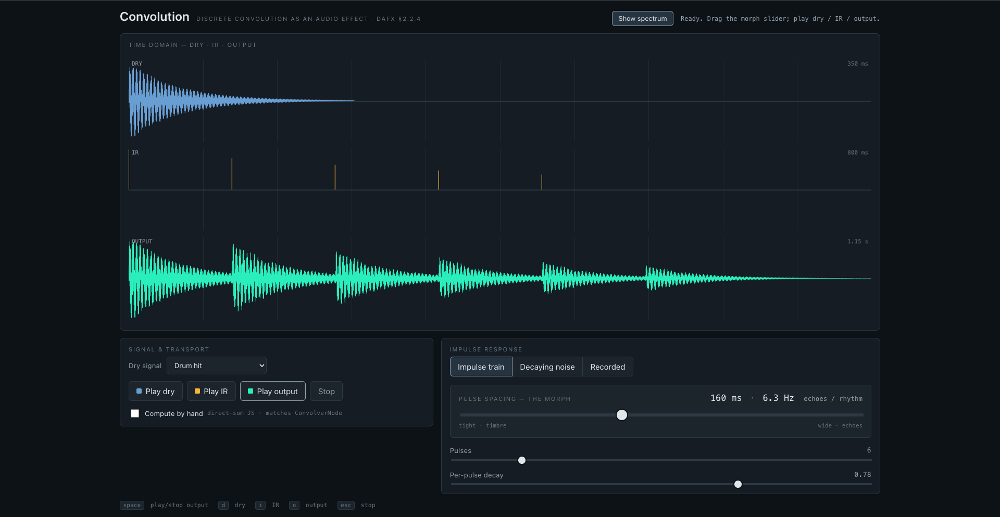

# DAFX Explorer

A WebApp to explore DSP algorithms and concepts presented in **DAFX — Digital
Audio Effects** (2nd ed.), edited by Udo Zölzer. Each example takes one idea from
the book and makes it interactive — something to hear and see, not just read.

The project is a growing collection of self-contained demos. For now it ships a
single example (convolution); more will be added over time.

## Examples

### Convolution — _DAFX §2.2.4_

Discrete convolution as an audio effect. Drag one slider and watch a rhythm of
discrete echoes fuse into a pitched comb-filter timbre — the same operation
at two time scales.



See the [app README](app/README.md) for what to try, keyboard controls, and
architecture notes.

## Running

The web app lives in [`app/`](app/). It's a Vite + Svelte 5 project:

```bash
cd app
npm install
npm run dev      # http://localhost:5173
```

## Repository layout

```
.
├── app/      the web app (Vite + Svelte 5, Web Audio API)
├── docs/     planning notes and reference material
└── README.md
```

## Reference

Udo Zölzer (ed.), _DAFX: Digital Audio Effects_, 2nd edition, Wiley.
